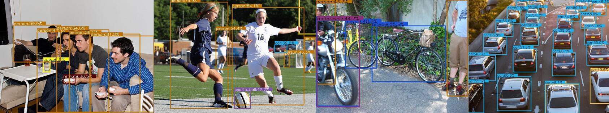
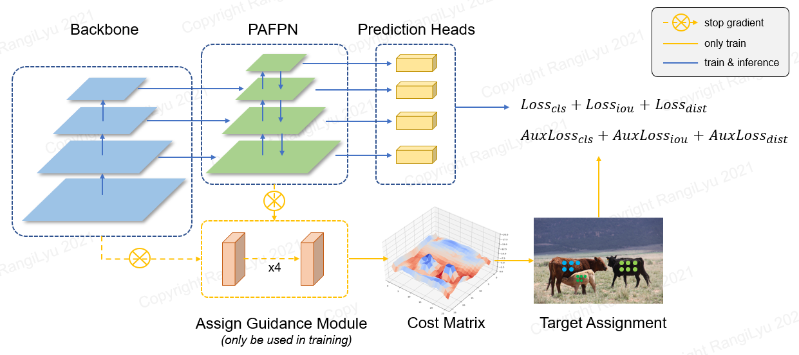
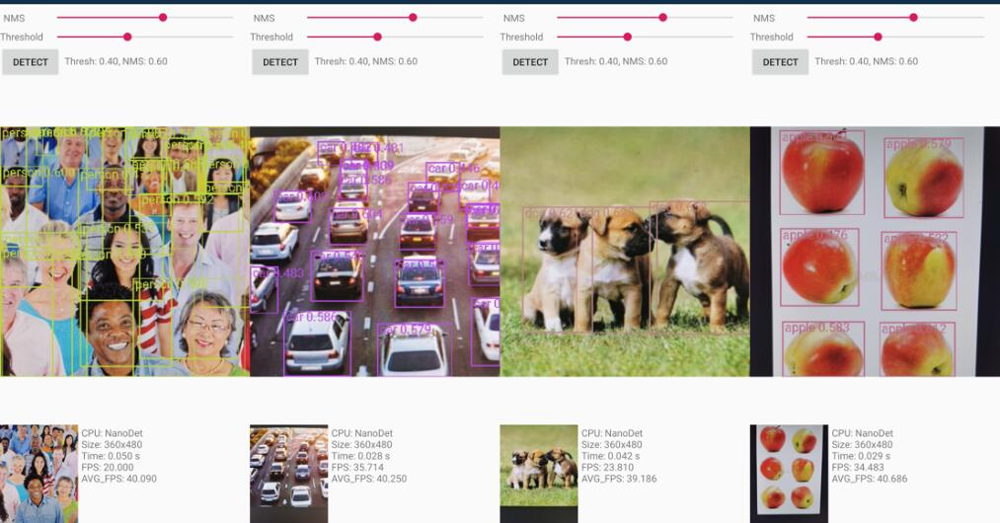

<div align="center">



# NanoDet-Plus
**Super fast and high accuracy lightweight anchor-free object detection model. Real-time on mobile devices.**


[](https://img.shields.io/github/checks-status/RangiLyu/nanodet/main?label=CI&style=flat)

[](https://github.com/RangiLyu/nanodet/blob/main/LICENSE)
[](https://img.shields.io/github/downloads/RangiLyu/nanodet/total?color=yellow&label=Downloads&logo=github&logoColor=lightgrey&style=flat)
[](https://img.shields.io/github/v/release/RangiLyu/nanodet?style=flat)

</div>

* ⚡Super lightweight: Model file is only 980KB(INT8) or 1.8MB(FP16).
* ⚡Super fast: 97fps(10.23ms) on mobile ARM CPU.
* 👍High accuracy: Up to **34.3 mAP<sup>val</sup>@0.5:0.95** and still realtime on CPU.
* 🤗Training friendly:  Much lower GPU memory cost than other models. Batch-size=80 is available on GTX1060 6G.
* 😎Easy to deploy: Support various backends including **ncnn, MNN and OpenVINO**. Also provide **Android demo** based on ncnn inference framework.

****

# Introduction




NanoDet is a FCOS-style one-stage anchor-free object detection model which using [Generalized Focal Loss](https://arxiv.org/pdf/2006.04388.pdf) as classification and regression loss.

In NanoDet-Plus, we propose a novel label assignment strategy with a simple **assign guidance module (AGM)** and a **dynamic soft label assigner (DSLA)** to solve the optimal label assignment problem in lightweight model training. We also introduce a light feature pyramid called Ghost-PAN to enhance multi-layer feature fusion. These improvements boost previous NanoDet's detection accuracy by **7 mAP** on COCO dataset.

[NanoDet-Plus 知乎中文介绍](https://zhuanlan.zhihu.com/p/449912627)

[NanoDet 知乎中文介绍](https://zhuanlan.zhihu.com/p/306530300)

QQ交流群：908606542 (答案：炼丹)

****
## Benchmarks

Model          |Resolution| mAP<sup>val<br>0.5:0.95 |CPU Latency<sup><br>(i7-8700) |ARM Latency<sup><br>(4xA76) | FLOPS      |   Params  | Model Size
:-------------:|:--------:|:-------:|:--------------------:|:--------------------:|:----------:|:---------:|:-------:
NanoDet-m      | 320*320 |   20.6   | **4.98ms**           | **10.23ms**          | **0.72G**  | **0.95M** | **1.8MB(FP16)** &#124; **980KB(INT8)**
**NanoDet-Plus-m** | 320*320 | **27.0** | **5.25ms**       | **11.97ms**          | **0.9G**   | **1.17M** | **2.3MB(FP16)** &#124; **1.2MB(INT8)**
**NanoDet-Plus-m** | 416*416 | **30.4** | **8.32ms**       | **19.77ms**          | **1.52G**  | **1.17M** | **2.3MB(FP16)** &#124; **1.2MB(INT8)**
**NanoDet-Plus-m-1.5x** | 320*320 | **29.9** | **7.21ms**  | **15.90ms**          | **1.75G**  | **2.44M** | **4.7MB(FP16)** &#124; **2.3MB(INT8)**
**NanoDet-Plus-m-1.5x** | 416*416 | **34.1** | **11.50ms** | **25.49ms**          | **2.97G**   | **2.44M** | **4.7MB(FP16)** &#124; **2.3MB(INT8)**
YOLOv3-Tiny    | 416*416 |   16.6   | -                    | 37.6ms               | 5.62G      | 8.86M     |   33.7MB
YOLOv4-Tiny    | 416*416 |   21.7   | -                    | 32.81ms              | 6.96G      | 6.06M     |   23.0MB
YOLOX-Nano     | 416*416 |   25.8   | -                    | 23.08ms              | 1.08G      | 0.91M     |   1.8MB(FP16)
YOLOv5-n       | 640*640 |   28.4   | -                    | 44.39ms              | 4.5G       | 1.9M      |   3.8MB(FP16)
FBNetV5        | 320*640 |   30.4   | -                    | -                    | 1.8G       | -         |   -
MobileDet      | 320*320 |   25.6   | -                    | -                    | 0.9G       | -         |   -

***Download pre-trained models and find more models in [Model Zoo](#model-zoo) or in [Release Files](https://github.com/RangiLyu/nanodet/releases)***

<details>
    <summary>Notes (click to expand)</summary>

* ARM Performance is measured on Kirin 980(4xA76+4xA55) ARM CPU based on ncnn. You can test latency on your phone with [ncnn_android_benchmark](https://github.com/nihui/ncnn-android-benchmark).

* Intel CPU Performance is measured Intel Core-i7-8700 based on OpenVINO.

* NanoDet mAP(0.5:0.95) is validated on COCO val2017 dataset with no testing time augmentation.

* YOLOv3&YOLOv4 mAP refers from [Scaled-YOLOv4: Scaling Cross Stage Partial Network](https://arxiv.org/abs/2011.08036).

</details>

****

## NEWS!!!

* [2023.01.20] Upgrade to [pytorch-lightning-1.9](https://github.com/Lightning-AI/lightning/releases/tag/1.9.0). The minimum PyTorch version is upgraded to 1.10. Support FP16 training(Thanks @crisp-snakey). Support ignore label(Thanks @zero0kiriyu).

* [2022.08.26] Upgrade to [pytorch-lightning-1.7](https://lightning.ai/). The minimum PyTorch version is upgraded to 1.9. To use previous version of PyTorch, please install [NanoDet <= v1.0.0-alpha-1](https://github.com/RangiLyu/nanodet/tags)

* [2021.12.25] **NanoDet-Plus** release! Adding **AGM**(Assign Guidance Module) & **DSLA**(Dynamic Soft Label Assigner) to improve **7 mAP** with only a little cost.

Find more update notes in [Update notes](docs/update.md).
## Demo

### Android demo



Android demo project is in ***demo_android_ncnn*** folder. Please refer to [Android demo guide](demo_android_ncnn/README.md).

Here is a better implementation 👉 [ncnn-android-nanodet](https://github.com/nihui/ncnn-android-nanodet)

### NCNN C++ demo

C++ demo based on [ncnn](https://github.com/Tencent/ncnn) is in ***demo_ncnn*** folder. Please refer to [Cpp demo guide](demo_ncnn/README.md).

### MNN demo

Inference using [Alibaba's MNN framework](https://github.com/alibaba/MNN) is in ***demo_mnn*** folder. Please refer to [MNN demo guide](demo_mnn/README.md).

### OpenVINO demo

Inference using [OpenVINO](https://01.org/openvinotoolkit) is in ***demo_openvino*** folder. Please refer to [OpenVINO demo guide](demo_openvino/README.md).

### Web browser demo

https://nihui.github.io/ncnn-webassembly-nanodet/

### Pytorch demo

First, install requirements and setup NanoDet following installation guide. Then download COCO pretrain weight from here

👉[COCO pretrain checkpoint](https://github.com/RangiLyu/nanodet/releases/download/v1.0.0-alpha-1/nanodet-plus-m_416_checkpoint.ckpt)

The pre-trained weight was trained by the config `config/nanodet-plus-m_416.yml`.

* Inference images

```bash
python demo/demo.py image --config CONFIG_PATH --model MODEL_PATH --path IMAGE_PATH
```

* Inference video

```bash
python demo/demo.py video --config CONFIG_PATH --model MODEL_PATH --path VIDEO_PATH
```

* Inference webcam

```bash
python demo/demo.py webcam --config CONFIG_PATH --model MODEL_PATH --camid YOUR_CAMERA_ID
```

Besides, We provide a notebook [here](./demo/demo-inference-with-pytorch.ipynb) to demonstrate how to make it work with PyTorch.

****

## Install

### Requirements

* Linux or MacOS
* CUDA >= 10.2
* Python >= 3.7
* Pytorch >= 1.10.0, <2.0.0

### Step

1. Create a conda virtual environment and then activate it.

```shell script
 conda create -n nanodet python=3.8 -y
 conda activate nanodet
```

2. Install pytorch

```shell script
conda install pytorch torchvision cudatoolkit=11.1 -c pytorch -c conda-forge
```

3. Clone this repository

```shell script
git clone https://github.com/RangiLyu/nanodet.git
cd nanodet
```

4. Install requirements

```shell script
pip install -r requirements.txt
```

5. Setup NanoDet
```shell script
python setup.py develop
```

****

## Model Zoo

NanoDet supports variety of backbones. Go to the [***config*** folder](config/) to see the sample training config files.

Model                 | Backbone           |Resolution|COCO mAP| FLOPS |Params | Pre-train weight |
:--------------------:|:------------------:|:--------:|:------:|:-----:|:-----:|:-----:|
NanoDet-m             | ShuffleNetV2 1.0x  | 320*320  |  20.6  | 0.72G | 0.95M | [Download](https://drive.google.com/file/d/1ZkYucuLusJrCb_i63Lid0kYyyLvEiGN3/view?usp=sharing) |
NanoDet-Plus-m-320 (***NEW***)     | ShuffleNetV2 1.0x | 320*320  |  27.0  | 0.9G  | 1.17M | [Weight](https://drive.google.com/file/d/1Dq0cTIdJDUhQxJe45z6rWncbZmOyh1Tv/view?usp=sharing) &#124; [Checkpoint](https://drive.google.com/file/d/1YvuEhahlgqxIhJu7bsL-fhaqubKcCWQc/view?usp=sharing)
NanoDet-Plus-m-416 (***NEW***)     | ShuffleNetV2 1.0x | 416*416  |  30.4  | 1.52G | 1.17M | [Weight](https://drive.google.com/file/d/1FN3WK3FLjBm7oCqiwUcD3m3MjfqxuzXe/view?usp=sharing) &#124; [Checkpoint](https://drive.google.com/file/d/1gFjyrl7O8p5APr1ZOtWEm3tQNN35zi_W/view?usp=sharing)
NanoDet-Plus-m-1.5x-320 (***NEW***)| ShuffleNetV2 1.5x | 320*320  |  29.9  | 1.75G | 2.44M | [Weight](https://drive.google.com/file/d/1Xdlgu5lxiS3w6ER7GE1mZpY663wmpcyY/view?usp=sharing) &#124; [Checkpoint](https://drive.google.com/file/d/1qXR6t3TBMXlz6GlTU3fxiLA-eueYoGrW/view?usp=sharing)
NanoDet-Plus-m-1.5x-416 (***NEW***)| ShuffleNetV2 1.5x | 416*416  |  34.1  | 2.97G | 2.44M | [Weight](https://drive.google.com/file/d/16FJJJgUt5VrSKG7RM_ImdKKzhJ-Mu45I/view?usp=sharing) &#124; [Checkpoint](https://drive.google.com/file/d/17sdAUydlEXCrHMsxlDPLj5cGb-8-mmY6/view?usp=sharing)


*Notice*: The difference between `Weight` and `Checkpoint` is the weight only provide params in inference time, but the checkpoint contains training time params.


Legacy Model Zoo

Model                 | Backbone           |Resolution|COCO mAP| FLOPS |Params | Pre-train weight |
:--------------------:|:------------------:|:--------:|:------:|:-----:|:-----:|:-----:|
NanoDet-m-416         | ShuffleNetV2 1.0x  | 416*416  |  23.5  |  1.2G | 0.95M | [Download](https://drive.google.com/file/d/1jY-Um2VDDEhuVhluP9lE70rG83eXQYhV/view?usp=sharing)|
NanoDet-m-1.5x        | ShuffleNetV2 1.5x  | 320*320  |  23.5  | 1.44G | 2.08M | [Download](https://drive.google.com/file/d/1_n1cAWy622LV8wbUnXImtcvcUVPOhYrW/view?usp=sharing) |
NanoDet-m-1.5x-416    | ShuffleNetV2 1.5x  | 416*416  |  26.8  | 2.42G | 2.08M | [Download](https://drive.google.com/file/d/1CCYgwX3LWfN7hukcomhEhGWN-qcC3Tv4/view?usp=sharing)|
NanoDet-m-0.5x        | ShuffleNetV2 0.5x  | 320*320  |  13.5  |  0.3G | 0.28M | [Download](https://drive.google.com/file/d/1rMHkD30jacjRpslmQja5jls86xd0YssR/view?usp=sharing) |
NanoDet-t             | ShuffleNetV2 1.0x  | 320*320  |  21.7  | 0.96G | 1.36M | [Download](https://drive.google.com/file/d/1TqRGZeOKVCb98ehTaE0gJEuND6jxwaqN/view?usp=sharing) |
NanoDet-g             | Custom CSP Net     | 416*416  |  22.9  |  4.2G | 3.81M | [Download](https://drive.google.com/file/d/1f2lH7Ae1AY04g20zTZY7JS_dKKP37hvE/view?usp=sharing)|
NanoDet-EfficientLite | EfficientNet-Lite0 | 320*320  |  24.7  | 1.72G | 3.11M | [Download](https://drive.google.com/file/d/1Dj1nBFc78GHDI9Wn8b3X4MTiIV2el8qP/view?usp=sharing)|
NanoDet-EfficientLite | EfficientNet-Lite1 | 416*416  |  30.3  | 4.06G | 4.01M | [Download](https://drive.google.com/file/d/1ernkb_XhnKMPdCBBtUEdwxIIBF6UVnXq/view?usp=sharing) |
NanoDet-EfficientLite | EfficientNet-Lite2 | 512*512  |  32.6  | 7.12G | 4.71M | [Download](https://drive.google.com/file/d/11V20AxXe6bTHyw3aMkgsZVzLOB31seoc/view?usp=sharing) |
NanoDet-RepVGG        | RepVGG-A0          | 416*416  |  27.8  | 11.3G | 6.75M | [Download](https://drive.google.com/file/d/1nWZZ1qXb1HuIXwPSYpEyFHHqX05GaFer/view?usp=sharing) |


****

## How to Train

1. **Prepare dataset**

    If your dataset annotations are pascal voc xml format, refer to [config/nanodet_custom_xml_dataset.yml](config/nanodet_custom_xml_dataset.yml)

    Otherwise, if your dataset annotations are YOLO format ([Darknet TXT](https://github.com/AlexeyAB/Yolo_mark/issues/60#issuecomment-401854885)), refer to [config/nanodet-plus-m_416-yolo.yml](config/nanodet-plus-m_416-yolo.yml)

    Or convert your dataset annotations to MS COCO format[(COCO annotation format details)](https://cocodataset.org/#format-data).

2. **Prepare config file**

    Copy and modify an example yml config file in config/ folder.

    Change ***save_dir*** to where you want to save model.

    Change ***num_classes*** in ***model->arch->head***.

    Change image path and annotation path in both ***data->train*** and ***data->val***.

    Set gpu ids, num workers and batch size in ***device*** to fit your device.

    Set ***total_epochs***, ***lr*** and ***lr_schedule*** according to your dataset and batchsize.

    If you want to modify network, data augmentation or other things, please refer to [Config File Detail](docs/config_file_detail.md)

3. **Start training**

   NanoDet is now using [pytorch lightning](https://github.com/PyTorchLightning/pytorch-lightning) for training.

   For both single-GPU or multiple-GPUs, run:

   ```shell script
   python tools/train.py CONFIG_FILE_PATH
   ```

4. **Visualize Logs**

    TensorBoard logs are saved in `save_dir` which you set in config file.

    To visualize tensorboard logs, run:

    ```shell script
    cd <YOUR_SAVE_DIR>
    tensorboard --logdir ./
    ```

****

## How to Deploy

NanoDet provide multi-backend C++ demo including ncnn, OpenVINO and MNN.
There is also an Android demo based on ncnn library.

### Export model to ONNX

To convert NanoDet pytorch model to ncnn, you can choose this way: pytorch->onnx->ncnn

To export onnx model, run `tools/export_onnx.py`.

```shell script
python tools/export_onnx.py --cfg_path ${CONFIG_PATH} --model_path ${PYTORCH_MODEL_PATH}
```

### Run NanoDet in C++ with inference libraries

### ncnn

Please refer to [demo_ncnn](demo_ncnn/README.md).

### OpenVINO

Please refer to [demo_openvino](demo_openvino/README.md).

### MNN

Please refer to [demo_mnn](demo_mnn/README.md).


### Run NanoDet on Android

Please refer to [android_demo](demo_android_ncnn/README.md).

****

## Citation

If you find this project useful in your research, please consider cite:

```BibTeX
@misc{=nanodet,
    title={NanoDet-Plus: Super fast and high accuracy lightweight anchor-free object detection model.},
    author={RangiLyu},
    howpublished = {\url{https://github.com/RangiLyu/nanodet}},
    year={2021}
}
```

****

## Thanks

https://github.com/Tencent/ncnn

https://github.com/open-mmlab/mmdetection

https://github.com/implus/GFocal

https://github.com/cmdbug/YOLOv5_NCNN

https://github.com/rbgirshick/yacs
