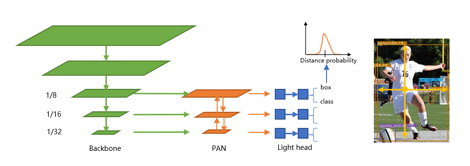

# NanoDet
[](https://img.shields.io/github/checks-status/RangiLyu/nanodet/main?label=CI&style=flat)

[](https://github.com/RangiLyu/nanodet/blob/main/LICENSE)
[](https://img.shields.io/github/downloads/RangiLyu/nanodet/total?color=yellow&label=Downloads&logo=github&logoColor=lightgrey&style=flat)
[](https://img.shields.io/github/v/release/RangiLyu/nanodet?style=flat)

### Super fast and lightweight anchor-free object detection model. Real-time on mobile devices.

* ⚡Super lightweight: Model file is only 980KB(INT8) or 1.8MB(FP16).
* ⚡Super fast: 97fps(10.23ms) on mobile ARM CPU.
* 😎Training friendly:  Much lower GPU memory cost than other models. Batch-size=80 is available on GTX1060 6G.
* 😎Easy to deploy: Provide **C++ implementation** with various backends and **Android demo** based on ncnn inference framework.

****
## NEWS!!!

* [2021.05.30] Release ncnn int8 models, and new pre-trained models with ShuffleNetV2-1.5x backbone. Much higher mAP but still realtime(**26.8mAP 21.53ms**).

* [2021.03.12] Apply the **Transformer** encoder to NanoDet! Introducing **NanoDet-t**, which replaces the PAN in NanoDet-m with a **TAN(Transformer Attention Net)**,  gets 21.7 mAP(+1.1) on COCO val 2017. Check [nanodet-t.yml](config/Transformer/nanodet-t.yml) for more details.

* [2021.03.03] Update **Nanodet-m-416** COCO pretrained model. **COCO mAP(0.5:0.95)=23.5**. Download in [Model Zoo](#model-zoo).

* [2021.02.03] Support [EfficientNet-Lite](https://github.com/RangiLyu/EfficientNet-Lite) and [Rep-VGG](https://github.com/DingXiaoH/RepVGG) backbone. Please check the [config folder](config/). Download models in [Model Zoo](#model-zoo)

* [2021.01.10] **NanoDet-g** with lower memory access cost, which designed for edge NPU or GPU, is now available!
  Check [config/nanodet-g.yml](config/nanodet-g.yml) and download in [Model Zoo](#model-zoo).

<details>
<summary>More...</summary>

* [2020.12.19] [MNN python and cpp demos](demo_mnn/) are available.

* [2020.12.05] Support voc .xml format dataset! Refer to [config/nanodet_custom_xml_dataset.yml](config/nanodet_custom_xml_dataset.yml).

* [2020.12.01] Great thanks to nihui, now you can try NanoDet running in web browser! 👉 https://nihui.github.io/ncnn-webassembly-nanodet/

</details>

****
## Benchmarks

Model          |Resolution|COCO mAP |Latency(ARM 4 Threads) | FLOPS      |   Params  | Model Size
:-------------:|:--------:|:-------:|:--------------------:|:----------:|:---------:|:-------:
NanoDet-m      | 320*320 |   20.6   | **10.23ms**          | **0.72G**  | **0.95M** | **1.8MB(FP16)** &#124; **980KB(INT8)**
NanoDet-m      | 416*416 |   23.5   | 16.44ms              | 1.2G       | **0.95M** | **1.8MB(FP16)** &#124; **980KB(INT8)**
NanoDet-m-1.5x | 320*320 |   23.5   | 13.53ms              | 1.44G      | 2.08M     |   3.9MB(FP16) &#124; 2MB(INT8)
NanoDet-m-1.5x | 416*416 | **26.8** | 21.53ms              | 2.42G      | 2.08M     |   3.9MB(FP16) &#124; 2MB(INT8)
NanoDet-g      | 416*416 |   22.9   | Not Designed For ARM | 4.2G       | 3.81M     |   7.7MB(FP16) &#124; 3.6MB(INT8)
YoloV3-Tiny    | 416*416 |   16.6   | 37.6ms               | 5.62G      | 8.86M     |   33.7MB
YoloV4-Tiny    | 416*416 |   21.7   | 32.81ms              | 6.96G      | 6.06M     |   23.0MB

***Find more models in [Model Zoo](#model-zoo)***

Note:

* Performance is measured on Kirin 980(4xA76+4xA55) ARM CPU based on ncnn. You can test latency on your phone with [ncnn_android_benchmark](https://github.com/nihui/ncnn-android-benchmark).

* NanoDet mAP(0.5:0.95) is validated on COCO val2017 dataset with no testing time augmentation.

* YOLO mAP refers from [Scaled-YOLOv4: Scaling Cross Stage Partial Network](https://arxiv.org/abs/2011.08036).

* **NanoDet-g** is designed for **edge NPU, GPU or TPU** with high parallel computing power but low memory bandwidth.
  It has much lower memory access cost than NanoDet-m.

****
NanoDet is a FCOS-style one-stage anchor-free object detection model which using ATSS for target sampling and using Generalized Focal Loss for classification and box regression. Please refer to these papers for more details.

[Fcos: Fully convolutional one-stage object detection](http://openaccess.thecvf.com/content_ICCV_2019/papers/Tian_FCOS_Fully_Convolutional_One-Stage_Object_Detection_ICCV_2019_paper.pdf)

[ATSS:Bridging the Gap Between Anchor-based and Anchor-free Detection via Adaptive Training Sample Selection](https://arxiv.org/pdf/1912.02424.pdf)

[Generalized Focal Loss: Learning Qualified and Distributed Bounding Boxes for Dense Object Detection](https://arxiv.org/pdf/2006.04388.pdf)




[知乎中文介绍](https://zhuanlan.zhihu.com/p/306530300)
 | QQ交流群：908606542 (答案：炼丹)

****
## Demo

### Android demo


Android demo project is in ***demo_android_ncnn*** folder. Please refer to [Android demo guide](demo_android_ncnn/README.md).

Here is a better implementation 👉 [ncnn-android-nanodet](https://github.com/nihui/ncnn-android-nanodet)

### NCNN C++ demo

C++ demo based on [ncnn](https://github.com/Tencent/ncnn) is in ***demo_ncnn*** folder. Please refer to [Cpp demo guide](demo_ncnn/README.md).

### MNN demo

Inference using [Alibaba's MNN framework](https://github.com/alibaba/MNN) is in ***demo_mnn*** folder. Including python and cpp inference code. Please refer to [MNN demo guide](demo_mnn/README.md).

### OpenVINO demo

Inference using [OpenVINO](https://01.org/openvinotoolkit) is in ***demo_openvino*** folder. Please refer to [OpenVINO demo guide](demo_openvino/README.md).

### Web browser demo

https://nihui.github.io/ncnn-webassembly-nanodet/

### Pytorch demo

First, install requirements and setup NanoDet following installation guide. Then download COCO pretrain weight from here

👉[COCO pretrain weight (Google Drive)](https://drive.google.com/file/d/1ZkYucuLusJrCb_i63Lid0kYyyLvEiGN3/view?usp=sharing)

* Inference images

```bash
python demo/demo.py image --config CONFIG_PATH --model MODEL_PATH --path IMAGE_PATH
```

* Inference video

```bash
python demo/demo.py video --config CONFIG_PATH --model MODEL_PATH --path VIDEO_PATH
```

* Inference webcam

```bash
python demo/demo.py webcam --config CONFIG_PATH --model MODEL_PATH --camid YOUR_CAMERA_ID
```

Besides, We provide a notebook [here](./demo/demo-inference-with-pytorch.ipynb) to demonstrate how to make it work with PyTorch.

****

## Install

### Requirements

* Linux or MacOS
* CUDA >= 10.0
* Python >= 3.6
* Pytorch >= 1.6
* experimental support Windows (Notice: Windows not support distributed training before pytorch1.7)

### Step

1. Create a conda virtual environment and then activate it.

```shell script
 conda create -n nanodet python=3.8 -y
 conda activate nanodet
```

2. Install pytorch

```shell script
conda install pytorch torchvision cudatoolkit=11.1 -c pytorch -c conda-forge
```

3. Install requirements

```shell script
pip install Cython termcolor numpy tensorboard pycocotools matplotlib pyaml opencv-python tqdm pytorch-lightning torchmetrics
```

4. Setup NanoDet

```shell script
git clone https://github.com/RangiLyu/nanodet.git
cd nanodet
python setup.py develop
```

****

## Model Zoo

NanoDet supports variety of backbones. Go to the [***config*** folder](config/) to see the sample training config files.

Model                 | Backbone           |Resolution|COCO mAP| FLOPS |Params | Pre-train weight |
:--------------------:|:------------------:|:--------:|:------:|:-----:|:-----:|:-----:|
NanoDet-m             | ShuffleNetV2 1.0x  | 320*320  |  20.6  | 0.72G | 0.95M | [Download](https://drive.google.com/file/d/1ZkYucuLusJrCb_i63Lid0kYyyLvEiGN3/view?usp=sharing) |
NanoDet-m-416         | ShuffleNetV2 1.0x  | 416*416  |  23.5  |  1.2G | 0.95M | [Download](https://drive.google.com/file/d/1jY-Um2VDDEhuVhluP9lE70rG83eXQYhV/view?usp=sharing)|
NanoDet-m-1.5x        | ShuffleNetV2 1.5x  | 320*320  |  23.5  | 1.44G | 2.08M | [Download](https://drive.google.com/file/d/1_n1cAWy622LV8wbUnXImtcvcUVPOhYrW/view?usp=sharing) |
NanoDet-m-1.5x-416    | ShuffleNetV2 1.5x  | 416*416  |  26.8  | 2.42G | 2.08M | [Download](https://drive.google.com/file/d/1CCYgwX3LWfN7hukcomhEhGWN-qcC3Tv4/view?usp=sharing)|
NanoDet-m-0.5x        | ShuffleNetV2 0.5x  | 320*320  |  13.5  |  0.3G | 0.28M | [Download](https://drive.google.com/file/d/1rMHkD30jacjRpslmQja5jls86xd0YssR/view?usp=sharing) |
NanoDet-t (***NEW***) | ShuffleNetV2 1.0x  | 320*320  |  21.7  | 0.96G | 1.36M | [Download](https://drive.google.com/file/d/1TqRGZeOKVCb98ehTaE0gJEuND6jxwaqN/view?usp=sharing) |
NanoDet-g             | Custom CSP Net     | 416*416  |  22.9  |  4.2G | 3.81M | [Download](https://drive.google.com/file/d/1f2lH7Ae1AY04g20zTZY7JS_dKKP37hvE/view?usp=sharing)|
NanoDet-EfficientLite | EfficientNet-Lite0 | 320*320  |  24.7  | 1.72G | 3.11M | [Download](https://drive.google.com/file/d/1Dj1nBFc78GHDI9Wn8b3X4MTiIV2el8qP/view?usp=sharing)|
NanoDet-EfficientLite | EfficientNet-Lite1 | 416*416  |  30.3  | 4.06G | 4.01M | [Download](https://drive.google.com/file/d/1ernkb_XhnKMPdCBBtUEdwxIIBF6UVnXq/view?usp=sharing) |
NanoDet-EfficientLite | EfficientNet-Lite2 | 512*512  |  32.6  | 7.12G | 4.71M | [Download](https://drive.google.com/file/d/11V20AxXe6bTHyw3aMkgsZVzLOB31seoc/view?usp=sharing) |
NanoDet-RepVGG        | RepVGG-A0          | 416*416  |  27.8  | 11.3G | 6.75M | [Download](https://drive.google.com/file/d/1nWZZ1qXb1HuIXwPSYpEyFHHqX05GaFer/view?usp=sharing) |


****

## How to Train

1. **Prepare dataset**

    If your dataset annotations are pascal voc xml format, refer to [config/nanodet_custom_xml_dataset.yml](config/nanodet_custom_xml_dataset.yml)

    Or convert your dataset annotations to MS COCO format[(COCO annotation format details)](https://cocodataset.org/#format-data).

2. **Prepare config file**

    Copy and modify an example yml config file in config/ folder.

    Change ***save_path*** to where you want to save model.

    Change ***num_classes*** in ***model->arch->head***.

    Change image path and annotation path in both ***data->train*** and ***data->val***.

    Set gpu ids, num workers and batch size in ***device*** to fit your device.

    Set ***total_epochs***, ***lr*** and ***lr_schedule*** according to your dataset and batchsize.

    If you want to modify network, data augmentation or other things, please refer to [Config File Detail](docs/config_file_detail.md)

3. **Start training**

   NanoDet is now using [pytorch lightning](https://github.com/PyTorchLightning/pytorch-lightning) for training.

   For both single-GPU or multiple-GPUs, run:

   ```shell script
   python tools/train.py CONFIG_FILE_PATH
   ```

   For **Windows users**, if you have problems with the new lightning trainer, try to use tools/deprecated/train.py

   <details>
   <summary>follow this...</summary>

   For single GPU, run

    ```shell script
    python tools/deprecated/train.py CONFIG_FILE_PATH
    ```

    For multi-GPU, NanoDet using distributed training. (Notice: Windows not support distributed training before pytorch1.7) Please run

    ```shell script
    python -m torch.distributed.launch --nproc_per_node=GPU_NUM --master_port 29501 tools/deprecated/train.py CONFIG_FILE_PATH
    ```

   </details>


4. **Visualize Logs**

    TensorBoard logs are saved in `save_dir` which you set in config file.

    To visualize tensorboard logs, run:

    ```shell script
    cd <YOUR_SAVE_DIR>
    tensorboard --logdir ./
    ```

****

## How to Deploy

NanoDet provide C++ and Android demo based on ncnn library.

1. Convert model

    To convert NanoDet pytorch model to ncnn, you can choose this way: pytorch->onnx->ncnn

    To export onnx model, run `tools/export_onnx.py`.

    ```shell script
    python tools/export_onnx.py --cfg_path ${CONFIG_PATH} --model_path ${PYTORCH_MODEL_PATH}
    ```

    Then using [onnx-simplifier](https://github.com/daquexian/onnx-simplifier) to simplify onnx structure.

    ```shell script
    python -m onnxsim ${INPUT_ONNX_MODEL} ${OUTPUT_ONNX_MODEL}
    ```

    Run **onnx2ncnn** in ncnn tools to generate ncnn .param and .bin file.

    After that, using **ncnnoptimize** to optimize ncnn model.

    If you have quentions about converting ncnn model, refer to ncnn wiki. https://github.com/Tencent/ncnn/wiki

2. Run NanoDet model with C++

    Please refer to [demo_ncnn](demo_ncnn/README.md).

3. Run NanoDet on Android

    Please refer to [android_demo](demo_android_ncnn/README.md).

****

## Thanks

https://github.com/Tencent/ncnn

https://github.com/open-mmlab/mmdetection

https://github.com/implus/GFocal

https://github.com/cmdbug/YOLOv5_NCNN

https://github.com/rbgirshick/yacs
