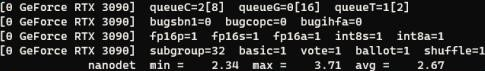

# NanoDet NCNN Demo

This project provides NanoDet image inference, webcam inference and benchmark using
[Tencent's NCNN framework](https://github.com/Tencent/ncnn).

# How to build

## Windows
### Step1.
Download and Install Visual Studio from https://visualstudio.microsoft.com/vs/community/

### Step2.
Download and install OpenCV from https://github.com/opencv/opencv/releases

### Step3 (Optional).
Download and install Vulkan SDK from https://vulkan.lunarg.com/sdk/home

### Step4.
Clone NCNN repository

``` shell script
git clone --recursive https://github.com/Tencent/ncnn.git
```
Build NCNN following this tutorial: [Build for Windows x64 using VS2017](https://github.com/Tencent/ncnn/wiki/how-to-build#build-for-windows-x64-using-visual-studio-community-2017)

### Step5.

Add `ncnn_DIR` = `YOUR_NCNN_PATH/build/install/lib/cmake/ncnn` to system environment variables.

Build project: Open x64 Native Tools Command Prompt for VS 2019 or 2017

``` cmd
mkdir -p build
cd build
cmake ..
msbuild nanodet_demo.vcxproj /p:configuration=release /p:platform=x64
```

## Linux

### Step1.
Build and install OpenCV from https://github.com/opencv/opencv

### Step2(Optional).
Download Vulkan SDK from https://vulkan.lunarg.com/sdk/home

### Step3.
Clone NCNN repository

``` shell script
git clone --recursive https://github.com/Tencent/ncnn.git
```

Build NCNN following this tutorial: [Build for Linux / NVIDIA Jetson / Raspberry Pi](https://github.com/Tencent/ncnn/wiki/how-to-build#build-for-linux)

### Step4.

Set environment variables. Run:

``` shell script
export ncnn_DIR=YOUR_NCNN_PATH/build/install/lib/cmake/ncnn
```

Build project

``` shell script
mkdir build
cd build
cmake ..
make
```

# Run demo

Download NanoDet ncnn model.
* [NanoDet-Plus ncnn model download link](https://drive.google.com/file/d/1cuVBJiFKwyq1-l3AwHoP2boTesUQP-6K/view?usp=sharing)

Unzip the file and rename the file to `nanodet.param` and `nanodet.bin`, then copy them to demo program folder (`demo_ncnn/build`).

## Webcam

```shell script
./nanodet_demo 0 0
```

## Inference images

```shell script
./nanodet_demo 1 ${IMAGE_FOLDER}/*.jpg
```

## Inference video

```shell script
./nanodet_demo 2 ${VIDEO_PATH}
```

## Benchmark

```shell script
./nanodet_demo 3 0
```

****

Notice:

If benchmark speed is slow, try to limit omp thread num.

Linux:

```shell script
export OMP_THREAD_LIMIT=4
```

Model               |Resolution|COCO mAP  | CPU Latency (i7-8700) | ARM CPU Latency (4*A76) | Vulkan GPU Latency (GTX1060) |
:------------------:|:--------:|:--------:|:---------------------:|:-----------------------:|:---------------------:|
NanoDet-Plus-m      | 320*320  |   27.0   | 10.32ms / 96.9FPS     | 11.97ms / 83.5FPS       | 3.40ms / 294.1FPS       |
NanoDet-Plus-m      | 416*416  |   30.4   | 17.98ms / 55.6FPS     | 19.77ms / 50.6FPS       | 4.27ms / 234.2FPS       |
NanoDet-Plus-m-1.5x | 320*320  |   29.9   | 12.87ms / 77.7FPS     | 15.90ms / 62.9FPS       | 3.78ms / 264.6FPS       |
NanoDet-Plus-m-1.5x | 416*416  |   34.1   | 22.53ms / 44.4FPS     | 25.49ms / 39.2FPS       | 4.79ms / 208.8FPS       |

# Custom model

## Export to ONNX

```shell script
python tools/export_onnx.py --cfg_path ${CONFIG_PATH} --model_path ${PYTORCH_MODEL_PATH}
```

## Convert to ncnn

Run **onnx2ncnn** in ncnn tools to generate ncnn .param and .bin file.

After that, using **ncnnoptimize** to optimize ncnn model.

If you have quentions about converting ncnn model, refer to ncnn wiki. https://github.com/Tencent/ncnn/wiki

You can also convert the model with an online tool https://convertmodel.com/ .

## Modify hyperparameters

If you want to use custom model, please make sure the hyperparameters
in `nanodet.h` are the same with your training config file.

```cpp
int input_size[2] = {416, 416}; // input height and width
int num_class = 80; // number of classes. 80 for COCO
int reg_max = 7; // `reg_max` set in the training config. Default: 7.
std::vector<int> strides = { 8, 16, 32, 64 }; // strides of the multi-level feature.
```
