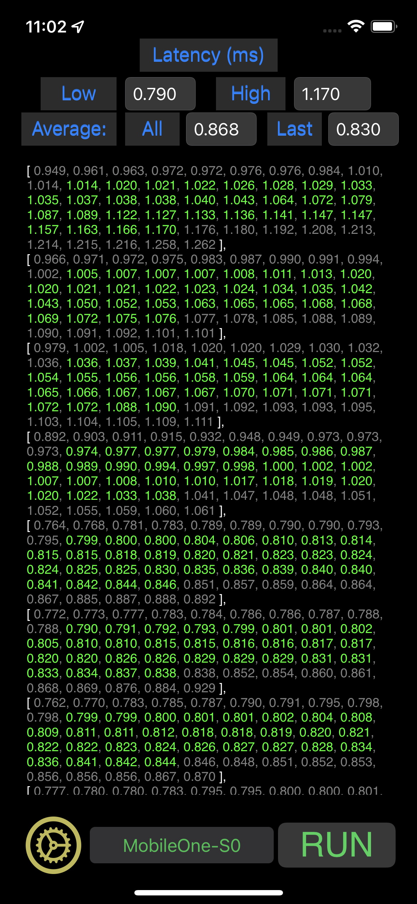

# iOS app for MobileOne model benchmark

## Download the CoreML model files

The ModelOne CoreML model `*.mlmodel` files (mobileone_s0.mlmodel,
mobileone_s1.mlmodel, mobileone_s2.mlmodel, mobileone_s3.mlmodel, and
mobileone_s4.mlmodel) are not in this repo, you will need to download from the
links in the `CoreML Model` column of the `MobileOne Model Zoo` table
in the top README.md file, and save to `ModelBench/ModelBench/Models` folder.
Or run the `fetch_models.sh` in the folder.

## Build and run
To build the app, Xcode version 13 or later is required. An iOS device running 
iOS 15 or later is preferred.

1. Open the `ModelBench.xcodeproj` project.
2. Update the `Team`, `Bundle Identifier` and `Signing Certificate` in the 
`Signing & Capacity` of the  ModelBench target for your organization.
3. Build and run the `ModelBench (Release)` scheme to benchmark models.

## Benchmark models
Model Bench is a simple app benchmarking Core ML models. On each benchmark
`Run`, the app will exercise the model in a number of rounds. Each round will
invoke the model for number of inferences. Each inference is with a dummy
input tensor, and inference output is retrieved but ignored. In each round, 
the model graph is loaded, the input tensor is preallocated, then the model
is called with number of inferences and latencies are measured. To eliminate
startup inconsistencies, the first inference is for warm-up and its latency
is ignored. All other inference latency values in a round are first sorted, 
then trimmed out give number of lowest and highest values. The resulted trimmed
latency numbers of all rounds are used to calculate the final low, high, and
average latency values.

### Here is a result display of a benchmark run for `MobileOne-S0` model.
Benchmark latencies in a round are sorted and displayed in square bracket. 
The greyed out latencies are trimmed out ones and only the green values are 
counted in the low, high, and average calculations.

### Change benchmarking settings
By default, the app will perform 20 rounds of 50 inferences on each benchmark run, 
then trim 10 lowest and 10 highest latency numbers in each round. You can change these 
configurations from the `Settings` gear button.

The model popup list at the bottom center will allow you to select different models
for benchmarking.

## Add models to benchmark
You can add Core ML models to the benchmark list with the following steps.

1. Drop a desired Core ML model to the Xcode project.
2. Add a new enum to `enum ModelType` in the `ViewController.swift`.
3. Add a new model variable to the model added in the `ViewController` class, 
similar to the `All MobileOne models`.
4. In the `runAndShowBenchmark` function, add model input variable for the 
new model, reinitialize and call the the model evaluation in the `for inference ...` 
loop.

### Note
The sample benchmarks were obtained on an iPhone 12 Pro. Results would vary
even on same type of devices.

## Contact
* [Jeff Zhu](mailto:jeff.zhu@apple.com) 
* [James Gabriel](mailto:james_gabriel@apple.com)
