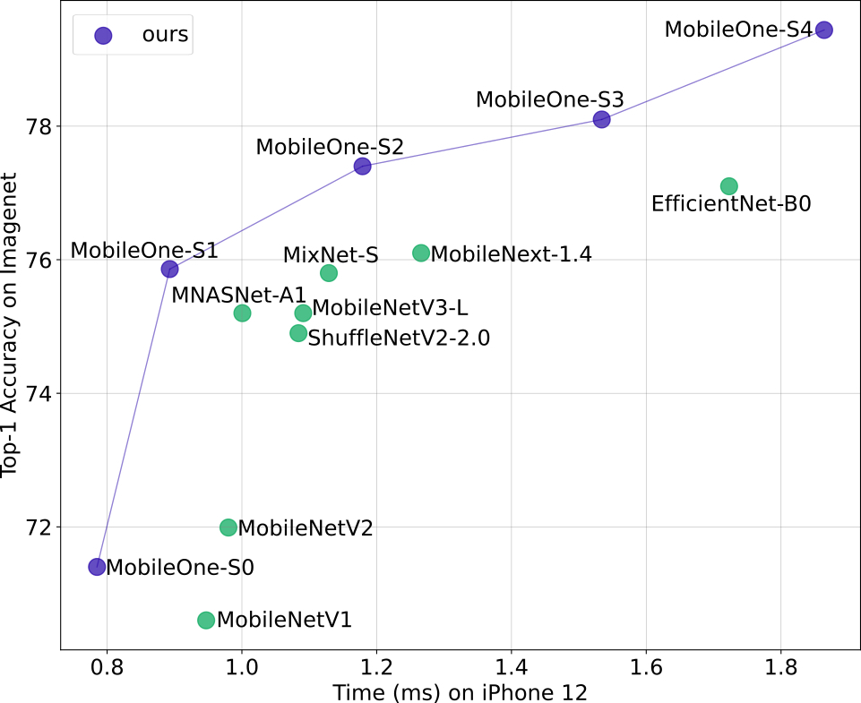

# MobileOne: An Improved One millisecond Mobile Backbone

This software project accompanies the research paper, [An Improved One millisecond Mobile Backbone](https://arxiv.org/abs/2206.04040).

Our model achieves Top-1 Accuracy of 75.9\% under 1ms.



## Model Zoo
### ImageNet-1K
| Model | Top-1 Acc.| Latency* | Pytorch Checkpoint (url) | CoreML Model |
| :--- | :---: | :---: | :---: | :---: |
| MobileOne-S0 | 71.4 | 0.79 | [S0](https://docs-assets.developer.apple.com/ml-research/datasets/mobileone/mobileone_s0.pth.tar)([unfused](https://docs-assets.developer.apple.com/ml-research/datasets/mobileone/mobileone_s0_unfused.pth.tar)) | [mlmodel](https://docs-assets.developer.apple.com/ml-research/datasets/mobileone/mobileone_s0.mlmodel) |
| MobileOne-S1 | 75.9 | 0.89 | [S1](https://docs-assets.developer.apple.com/ml-research/datasets/mobileone/mobileone_s1.pth.tar)([unfused](https://docs-assets.developer.apple.com/ml-research/datasets/mobileone/mobileone_s1_unfused.pth.tar)) | [mlmodel](https://docs-assets.developer.apple.com/ml-research/datasets/mobileone/mobileone_s1.mlmodel) |
| MobileOne-S2 | 77.4 | 1.18 | [S2](https://docs-assets.developer.apple.com/ml-research/datasets/mobileone/mobileone_s2.pth.tar)([unfused](https://docs-assets.developer.apple.com/ml-research/datasets/mobileone/mobileone_s2_unfused.pth.tar)) | [mlmodel](https://docs-assets.developer.apple.com/ml-research/datasets/mobileone/mobileone_s2.mlmodel) |
| MobileOne-S3 | 78.1 | 1.53 | [S3](https://docs-assets.developer.apple.com/ml-research/datasets/mobileone/mobileone_s3.pth.tar)([unfused](https://docs-assets.developer.apple.com/ml-research/datasets/mobileone/mobileone_s3_unfused.pth.tar)) | [mlmodel](https://docs-assets.developer.apple.com/ml-research/datasets/mobileone/mobileone_s3.mlmodel) |
| MobileOne-S4 | 79.4 | 1.86 | [S4](https://docs-assets.developer.apple.com/ml-research/datasets/mobileone/mobileone_s4.pth.tar)([unfused](https://docs-assets.developer.apple.com/ml-research/datasets/mobileone/mobileone_s4_unfused.pth.tar)) | [mlmodel](https://docs-assets.developer.apple.com/ml-research/datasets/mobileone/mobileone_s4.mlmodel) |

*Latency measured on iPhone 12 Pro.

## Usage
To use our model, follow the code snippet below,

```python
import torch
from mobileone import mobileone, reparameterize_model

# To Train from scratch/fine-tuning
model = mobileone(variant='s0')
# ... train ...

# Load Pre-trained checkpoint for fine-tuning
checkpoint = torch.load('/path/to/unfused_checkpoint.pth.tar')
model.load_state_dict(checkpoint)
# ... train ...

# For inference
model.eval()      
model_eval = reparameterize_model(model)
# Use model_eval at test-time
```
To simply evaluate our model, use the fused checkpoint where branches are re-parameterized.
```python
import torch
from mobileone import mobileone

model = mobileone(variant='s0', inference_mode=True)
checkpoint = torch.load('/path/to/checkpoint.pth.tar')
model.load_state_dict(checkpoint)
# ... evaluate/demo ...
``` 

## ModelBench App

An iOS benchmark app for MobileOne CoreML models. See 
[ModelBench](ModelBench/README.md) for addition details on building
and running the app. 


## Citation

If our code or models help your work, please cite our [paper](https://arxiv.org/abs/2206.04040):
```BibTeX
@article{mobileone2022,
  title={An Improved One millisecond Mobile Backbone},
  author={Vasu, Pavan Kumar Anasosalu and Gabriel, James and Zhu, Jeff and Tuzel, Oncel and Ranjan, Anurag},
  journal={arXiv preprint arXiv:2206.04040},
  year={2022}
}
```
